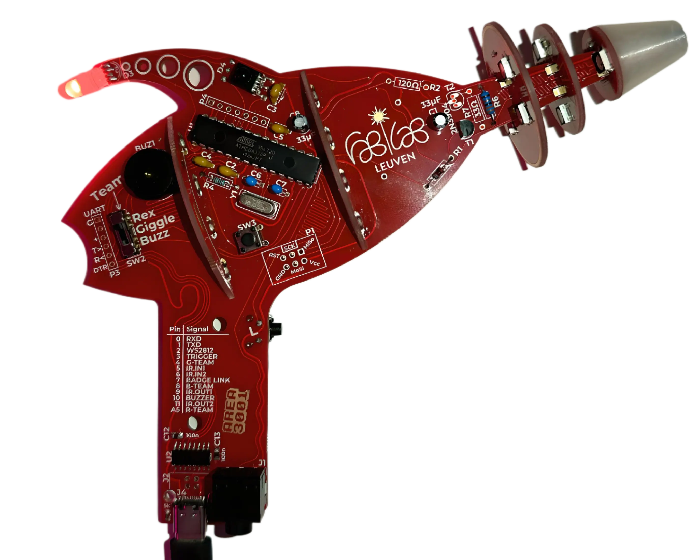

# Fri3d Camp 2024 Badge and Addons

[**Update your Badge!**](onboarding/firstupdate)

You're looking for info on one of these boards? Click on it:

## Play with it

You don't need to be a programming wizard to have fun with this badge!
Go to the [Onboarding](onboarding) pages to see all the cool features we built into the standard firmware.

## Program it

Congratulations! If you want to squash some bugs, you're going to need some tools...

- You can use **C++** in the [Arduino editor](arduino), or [Visual Studio Code](platformio)
- If you prefer [Python](micropython), you can use any plain text editor, but Visual Studio Code works too.
- If you are into homeassistant and want to connect your badge using [esphome](esphome). You can either use the command line or esphome dashboard.
- If typing code is not your thing, you can drag blocks in [bipes](bipes)
- The `blaster-2022`, `blaster-2024`(flamingo) and communicator can also be programmed with [Embeetle IDE](https://embeetle.com). Click on your board at the top of this webpage for a step-by-step guide.

## Revert to Default Firmware

If your badge is not starting up or you want to revert to the default software, then go to the badge/solder tent where the badge repair station is located. On this PC, you can follow step-by-step instructions to flash each board. Or [click here to see how you can reset the board yourself](reset).

## Documentation

- [The introduction](https://github.com/Fri3dCamp/badge_2024)
- [The hardware](https://github.com/Fri3dCamp/badge_2024_hw)
- [C++ examples](https://github.com/Fri3dCamp/badge_2024_arduino)
- [pre-loaded Firmware](https://github.com/Fri3dCamp/badge_2024_micropython)
